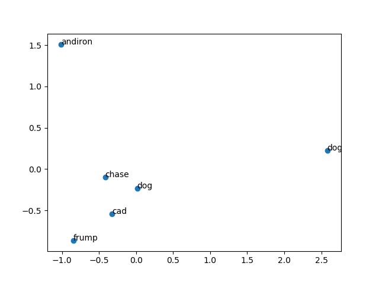

# Assignment 3

### Word Sense

In this assignment, we required to identify the Most Frequent Sense of a word using Word Embeddings.

The following graph shows the frequency of word using the word embeddings:

The axises are features for the word embeddings. Here in the graph, 'dog' is shown with both word meaning and word sense.
